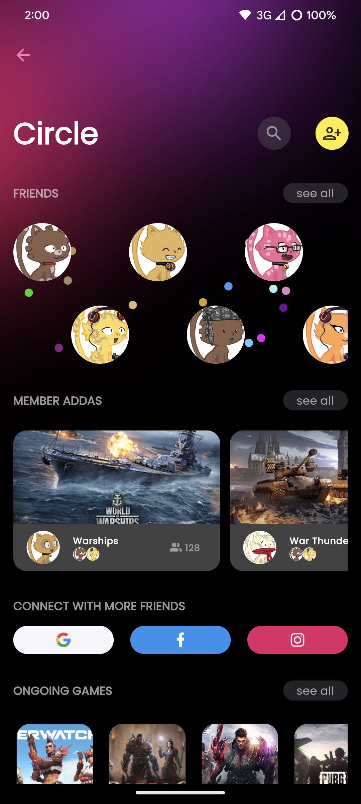
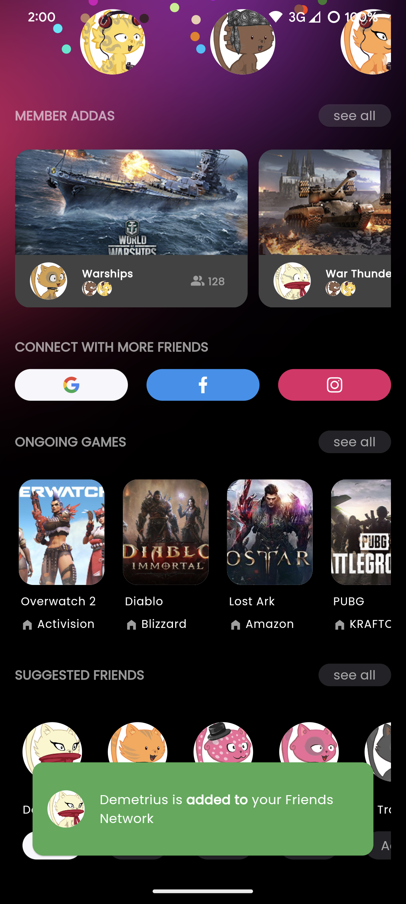
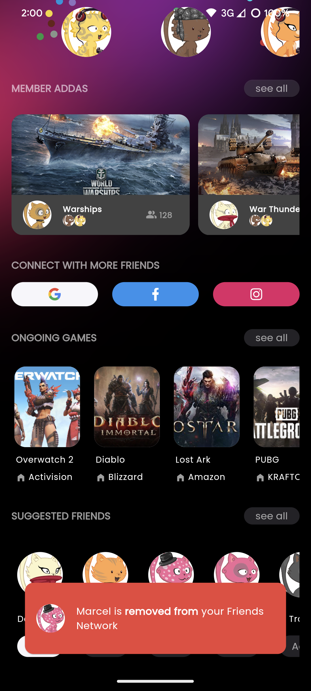

# Vyld Flutter Task

I've completed the take-home challenge for the Flutter Developer position. The code recreates the provided design as requested. 


## Screenshots

   


## Run Locally

Clone the project

```bash
  git clone https://github.com/CharanRajana/vyld_flutter_task.git
```

Go to the project directory

```bash
  cd local-rep-location/vyld_flutter_task
```

Install dependencies

```bash
  flutter pub get
```

Start the flutter project

```bash
  flutter run
```


## Download

To download a prebuilt apk of this project for a quicker overview, head over to this Google Drive [link](https://drive.google.com/file/d/1dzmNGYYcjB0atPKjSL9Z8-UfjAdeaXbS/view?usp=drivesdk)
